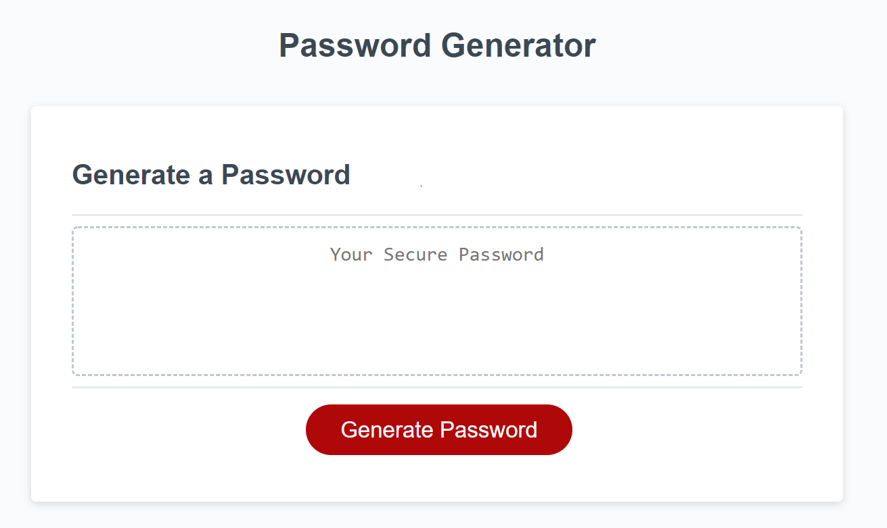

# Random-pw3

## Password Generator Program

### Summary 

This project serves the purpose of providing a randomly generated password based on the user's choices. 
When the user goes through a series of prompts to confirm what type of characters they will want on their password. 
Password Generator is a program designed to demonstrate the core understanding of the fundamentals of JavaScript.

### Link to my project
[Click here to get a random Password!](https://github.com/Bootcamp874/Random-pw3)

### Contributions 
Thanks to my fellow students and teaching assistants that help me throughout this project. Especial thanks to our assignment creator that provided helpful starter code for the button and the text input for the created password.

### Program Image

